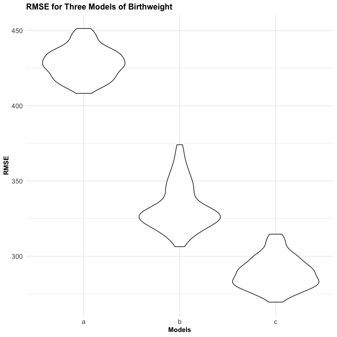

p8105_hw6_amz2148
================

Data Science: Homework 3

# Problem 0

``` r
library(tidyverse) #loads tidyverse package
```

    ## ── Attaching packages ─────────────────────────────────────── tidyverse 1.3.2 ──
    ## ✔ ggplot2 3.4.0      ✔ purrr   0.3.5 
    ## ✔ tibble  3.1.8      ✔ dplyr   1.0.10
    ## ✔ tidyr   1.2.0      ✔ stringr 1.4.1 
    ## ✔ readr   2.1.3      ✔ forcats 0.5.2 
    ## ── Conflicts ────────────────────────────────────────── tidyverse_conflicts() ──
    ## ✖ dplyr::filter() masks stats::filter()
    ## ✖ dplyr::lag()    masks stats::lag()

``` r
library(purrr) #loads purrr package
library(patchwork) #loads patchwork package
library(modelr) #loads modelr package
library(mgcv) #loads mgcv package
```

    ## Loading required package: nlme
    ## 
    ## Attaching package: 'nlme'
    ## 
    ## The following object is masked from 'package:dplyr':
    ## 
    ##     collapse
    ## 
    ## This is mgcv 1.8-40. For overview type 'help("mgcv-package")'.

``` r
knitr::opts_chunk$set(echo = TRUE) #shows all code chunks
knitr::opts_chunk$set(
  fig.width = 7,
  fig.asp = 1,
  out.width = "100%") #sets figure dimensions

theme_set(theme_minimal() + theme(legend.position = "bottom")) #sets default figure theme
```

# Problem 1

# Problem 2

First we import the `homicides` dataset from the Washington Post
(originally called `homicide_data.csv`). We also change all unknown
values to NA for consistency as some (but not all) variables are already
coded this way.

``` r
homicides = 
  read_csv("data/homicide_data.csv") %>% #loads csv file
  janitor::clean_names() %>% #cleans variable names
  gdata::unknownToNA("Unknown", warning = FALSE) #changes all "unknown" values to "NA"
```

    ## Rows: 52179 Columns: 12
    ## ── Column specification ────────────────────────────────────────────────────────
    ## Delimiter: ","
    ## chr (9): uid, victim_last, victim_first, victim_race, victim_age, victim_sex...
    ## dbl (3): reported_date, lat, lon
    ## 
    ## ℹ Use `spec()` to retrieve the full column specification for this data.
    ## ℹ Specify the column types or set `show_col_types = FALSE` to quiet this message.

Next, we create a `city_state` variable (e.g. “Baltimore, MD”) and a
binary `status` variable indicating whether the homicide is solved. We
omit cities Dallas, TX; Phoenix, AZ; and Kansas City, MO – these don’t
report victim race. We also omit Tulsa, AL – this is a data entry
mistake. For this problem, we limit our analysis to those for whom
`victim_race` is white or black. We also convert `victim_age` to numeric
form.

``` r
homicides = 
  homicides %>% 
  mutate(state = replace(state, state == "wI", "WI")) %>% #fixes values erroneously labeled wI
  mutate(city_state = paste(city, state, sep = ", ")) %>% #creates city_state variable
  mutate(status = case_when(disposition == "Closed without arrest" | disposition == "Open/No arrest" ~ "Unresolved", disposition == "Closed by arrest" ~ "Resolved")) %>% #creates binary status variable
  filter(city_state != "Dallas, TX", city_state != "Phoenix, AZ", city_state != "Kansas City, MO", city_state != "Tulsa, AL") %>% #omits specified cities
  filter(victim_race == "White" | victim_race == "Black") %>% #limits analyses to only White and Black victims
mutate(
    statusdbl = as.numeric(status == "Resolved"), #creates numeric, binary status variable where resolved = 1, unresolved = 0
    victim_age = as.numeric(victim_age), #reclassifies age as numeric variable
    victim_racedbl = as.numeric(victim_race == "White"), #creates numeric race variable where White = 1, Black = 0
    victim_sexdbl = as.numeric(victim_sex == "Female")) #creates numeric sex variable where Female = 1, Male = 0

head(homicides) #outputs first few rows of dataset
```

    ## # A tibble: 6 × 17
    ##   uid    repor…¹ victi…² victi…³ victi…⁴ victi…⁵ victi…⁶ city  state   lat   lon
    ##   <chr>    <dbl> <chr>   <chr>   <chr>     <dbl> <chr>   <chr> <chr> <dbl> <dbl>
    ## 1 Alb-0…  2.01e7 SATTER… VIVIANA White        15 Female  Albu… NM     35.1 -107.
    ## 2 Alb-0…  2.01e7 MULA    VIVIAN  White        72 Female  Albu… NM     35.1 -107.
    ## 3 Alb-0…  2.01e7 BOOK    GERALD… White        91 Female  Albu… NM     35.2 -107.
    ## 4 Alb-0…  2.01e7 MARTIN… GUSTAVO White        56 Male    Albu… NM     35.1 -107.
    ## 5 Alb-0…  2.01e7 LUJAN   KEVIN   White        NA Male    Albu… NM     35.1 -107.
    ## 6 Alb-0…  2.01e7 GRAY    STEFAN… White        43 Female  Albu… NM     35.1 -107.
    ## # … with 6 more variables: disposition <chr>, city_state <chr>, status <chr>,
    ## #   statusdbl <dbl>, victim_racedbl <dbl>, victim_sexdbl <dbl>, and abbreviated
    ## #   variable names ¹​reported_date, ²​victim_last, ³​victim_first, ⁴​victim_race,
    ## #   ⁵​victim_age, ⁶​victim_sex

For the city of Baltimore, MD, we use the `glm` function to fit a
logistic regression with resolved vs unresolved as the outcome and
victim age, sex and race as predictors. We save the output of `glm` as
an R object; apply `broom::tidy` to this object; and obtain the estimate
and confidence interval of the adjusted odds ratio for solving homicides
comparing male victims to female victims, keeping all other variables
fixed.

``` r
baltimore_logistic = 
  homicides %>% 
  filter(city_state == "Baltimore, MD") %>% #restricts dataset to Baltimore, MD
  glm(statusdbl ~ victim_age + victim_sexdbl + victim_racedbl, data = ., family = binomial()) #runs logistic regression with outcome of status and covariates of age, sex, and race

baltimore_OR = 
  baltimore_logistic %>% 
  broom::tidy(conf.int = TRUE) %>% #tidies regression output into dataframe, adds ln confidence intervals
  janitor::clean_names() %>% #cleans variable names
  mutate(
    OR = exp(estimate),
    conf_low = exp(conf_low),
    conf_high = exp(conf_high)) %>% #creates OR variable and exponentiated CIs
  select(term, OR, conf_low, conf_high) %>% #selects only specified variables
  filter(term == "victim_sexdbl") %>% #keeps only results for victim_sex variable
  knitr::kable(digits = 3) #creates table with resulting data

baltimore_OR #outputs table
```

| term          |   OR | conf_low | conf_high |
|:--------------|-----:|---------:|----------:|
| victim_sexdbl | 2.35 |    1.794 |     3.085 |

As the above table demonstrates, the estimated odds ratio comparing the
odds of having a resolved homicide (as opposed to unresolved) in Black
or White females from Baltimore, MD was 2.35 times the odds of having a
resolved homicide in Black or White males from Baltimore, MD - holding
victim age and race constant. We are 95% confident that the true odds
ratio comparing resolved status in Black and White females vs. males in
Baltimore, MD for this time period lies between 1.794 and 3.085.

Now, we run `glm` for each of the cities in the `homicides` dataset, and
extract the adjusted odds ratio and CI for solving homicides comparing
male victims to female victims. We do this within a “tidy” pipeline,
making use of `purrr::map`, list columns, and `unnest` as necessary to
create a dataframe with estimated ORs and CIs for each city.

``` r
all_cities = 
  homicides %>% 
  select(city_state, everything()) %>% #reorders variables
  nest(data = uid:victim_sexdbl) %>% #nests all data but city_state variable
  mutate(log_model = map(data, ~ glm(statusdbl ~ victim_age + victim_sexdbl + victim_racedbl, data = ., family = binomial()))) %>% #runs logistic regression with outcome of status and covariates of age, sex, and race
  mutate(model_info = map(log_model, broom::tidy, conf.int = TRUE)) %>% #ouputs model results into list column within dataframe
  select(city_state, model_info) %>% #selects only certain variables/columns
  unnest(cols = model_info) %>% #unnests data from model_info column
  janitor::clean_names() %>% #cleans variable names
  mutate(
    OR = exp(estimate),
    conf_low = exp(conf_low),
    conf_high = exp(conf_high)) %>% #creates OR variable and exponentiated CIs
  select(city_state, term, OR, conf_low, conf_high) %>% #selects only specified variables
  filter(term == "victim_sexdbl") %>% #keeps only results for victim_sex
  mutate(city_state = reorder(city_state, -OR)) #reorders city_state variables in order of descending ORs
  
head(all_cities) #displays first few rows of all_cities dataset
```

    ## # A tibble: 6 × 5
    ##   city_state      term             OR conf_low conf_high
    ##   <fct>           <chr>         <dbl>    <dbl>     <dbl>
    ## 1 Albuquerque, NM victim_sexdbl 0.566    0.266      1.21
    ## 2 Atlanta, GA     victim_sexdbl 1.00     0.686      1.47
    ## 3 Baltimore, MD   victim_sexdbl 2.35     1.79       3.08
    ## 4 Baton Rouge, LA victim_sexdbl 2.62     1.46       4.89
    ## 5 Birmingham, AL  victim_sexdbl 1.15     0.761      1.75
    ## 6 Boston, MA      victim_sexdbl 1.50     0.794      2.85

Finally, we create a plot that shows the estimated ORs and CIs for each
city organized according to estimated OR.

``` r
ggplot(all_cities, aes( x = city_state, y = OR)) + #creates ggplot of city_state vs. proportion of unsolved homicides
  geom_bar(stat = 'identity', alpha = 0.7, fill = "#d98fcc") + #creates bar-chart
  geom_errorbar(aes(ymin = conf_low, ymax = conf_high), alpha = 0.7) +  #adds error-bars
  theme(plot.title = element_text(size = 12, face = "bold")) + #edits title size
  theme(axis.text.x = element_text(angle = 90, vjust = 0.5, hjust = 1, size = 10)) + #edits appearance of x axis labels
  theme(axis.text.y = element_text(size = 10)) + #edits y axis label size
  theme(axis.title = element_text(size = 10, face = "bold")) + #edits axes title sizes
  theme(plot.caption = element_text(size = 8)) + #edits caption size
  labs(
      title = "Odds ratios for solved homicides in female vs. male victims",
      x = "City, State",
      y = "Odds Ratio",
      caption = "Data from Washington Post. Odds ratios are adjusted for race (Black or White) and age of victim. Error bars show 95% confidence intervals.") #adds figure title, axes titles, and caption
```


The resulting plot shows that New York, NY has the highest OR of solved
homicides in female vs. male victims, controlling for age and race. This
means that in New York, female victims have the greatest odds when
compared to those of males for having a solved homicide. The ORs are
highly variable across U.S. cities, with most having ORs greater than 1,
but some having ORs less than 1 (which means in these latter cities,
male victims have a higher odds of having a solved homicide compared to
females). The confidence intervals, however, of many of these estimates
are quite large. Furthermore many include the null value of 1, which
means that in tose cities, there is no statistically significant
difference between odds of having a solved homicide in female vs. male
victims.

# Problem 3

First, we load and clean the `birthweight.csv` data for regression
analysis (i.e., convert numeric to factor variables where appropriate,
check for missing data, etc.).

``` r
birthweight = 
  read_csv("data/birthweight.csv") %>% #loads csv file
  janitor::clean_names() %>% #cleans variable names
  mutate(frace = as.factor(frace), mrace = as.factor(mrace), babysex = as.factor(babysex), malform = as.factor(malform)) %>% #converts frace, mrace, babysex, and malform variables to factor form
  mutate(
    frace = recode(frace, "1" = "White", "2" = "Black", "3" = "Asian", "4" = "Puerto Rican", "8" = "Other"),
    mrace = recode(mrace, "1" = "White", "2" = "Black", "3" = "Asian", "4" = "Puerto Rican", "8" = "Other"),
    babysex = recode(babysex, "1" = "Male", "2" = "Female"),
    malform = recode(malform, "0" = "Absent", "1" = "Present")) %>% #recodes factor variable levels to display words instead of numbers
  mutate_at(c('menarche'), ~na_if(., 0)) #replaces 0 menarche value with NA
```

    ## Rows: 4342 Columns: 20
    ## ── Column specification ────────────────────────────────────────────────────────
    ## Delimiter: ","
    ## dbl (20): babysex, bhead, blength, bwt, delwt, fincome, frace, gaweeks, malf...
    ## 
    ## ℹ Use `spec()` to retrieve the full column specification for this data.
    ## ℹ Specify the column types or set `show_col_types = FALSE` to quiet this message.

In the `birthweight` dataset, there are `4342` rows (observations) and
`20` columns (variables). The variables’ names are
`babysex, bhead, blength, bwt, delwt, fincome, frace, gaweeks, malform, menarche, mheight, momage, mrace, parity, pnumlbw, pnumsga, ppbmi, ppwt, smoken, wtgain`.
The father’s race, mother’s race, baby’s sex, and presence of
weight-affecting malformations variables were recoded as factor
variables with their appropriate labels. There were no missing values
identified other than one menarche value that was 0 years old at
menarche; this was changed to NA.

Next, we propose a regression model for birthweight. This model may be
based on a hypothesized structure for the factors that underly
birthweight, on a data-driven model-building process, or a combination
of the two. We then create a plot of model residuals against fitted
values, using `add_predictions` and `add_residuals` to make this plot.

``` r
birthweight_crude = lm(bwt ~ gaweeks, data = birthweight) #creates crude linear model of gaweeks (x) and bwt (y)
birthweight_adjusted = lm(bwt ~ gaweeks + smoken + mrace + delwt, data = birthweight) #creates adjusted model of bwt (y) and covariates gaweks, smoken, mrace, and delwt

birthweight_crude_table = 
  birthweight_crude %>% 
  broom::tidy(conf.int = TRUE) %>% #creates dataframe from crude model results
  janitor::clean_names() %>% #cleans variable names
  select(term, estimate, p_value, conf_low, conf_high) #selects only key variables

birthweight_crude_table %>% 
  knitr::kable() #outputs crude model results in tabular
```

| term        |  estimate | p_value |  conf_low | conf_high |
|:------------|----------:|--------:|----------:|----------:|
| (Intercept) | 476.00261 |   1e-07 | 301.89144 | 650.11378 |
| gaweeks     |  66.91991 |   0e+00 |  62.51785 |  71.32197 |

``` r
birthweight_adjusted_table = 
  birthweight_adjusted %>% 
  broom::tidy(conf.int = TRUE) %>% #creates dataframe from adjusted model results
  janitor::clean_names() %>% #cleans variable names
  select(term, estimate, p_value, conf_low, conf_high) #selects only key variables

birthweight_adjusted_table %>% 
  knitr::kable() #outputs crude model results in tabular form
```

| term              |    estimate |   p_value |    conf_low |   conf_high |
|:------------------|------------:|----------:|------------:|------------:|
| (Intercept)       |  299.819635 | 0.0009161 |  122.633104 |  477.006166 |
| gaweeks           |   54.392720 | 0.0000000 |   50.263622 |   58.521817 |
| smoken            |  -11.661535 | 0.0000000 |  -13.436093 |   -9.886976 |
| mraceBlack        | -294.958408 | 0.0000000 | -322.594868 | -267.321947 |
| mraceAsian        |  -55.127569 | 0.4047471 | -184.833703 |   74.578566 |
| mracePuerto Rican | -143.767872 | 0.0000009 | -200.979009 |  -86.556735 |
| delwt             |    5.885025 | 0.0000000 |    5.302966 |    6.467084 |

``` r
birthweight %>% 
  modelr::add_residuals(birthweight_adjusted) %>% #adds residuals to dataframe
  modelr::add_predictions(birthweight_adjusted) %>% #adds fitted values to dataframe
  ggplot(aes(x = pred, y = resid)) + geom_point(alpha = 0.5) + #creates scatterplot of residuals and fitted values
  theme(plot.title = element_text(size = 12, face = "bold")) + #edits title size
  theme(axis.text.x = element_text(size = 10)) + #edits appearance of x axis labels
  theme(axis.text.y = element_text(size = 10)) + #edits y axis label size
  theme(axis.title = element_text(size = 10, face = "bold")) + #edits axes title sizes
  labs(
      title = "Birthweight Model A Residuals vs. Fitted Values",
      x = "Fitted Values",
      y = "Residuals") #adds figure title and axes titles
```


In creating this linear model of the outcome birthweight (`bwt`), I
chose to use the gestational age (`gaweeks` or gestational age in weeks)
as this is a variable known to be correlated with birthweight. To create
the adjusted model, I included my primary exposure variable and several
covariates that I theorized would act as confounders to the
exposure-outcome relationship. These covariates were maternal race,
maternal smoking during pregnancy (number of cigarettes smoked per day),
and maternal weight at delivery (pounds). These variables are all
hypothesized to be related to the exposure and outcome of interest and
not on the causal pathway between the main variables of interest. I also
created a crude model of gestational age and birthweight I found that
the beta coefficient for `gaweeks` changed substantially from the crude
to adjusted model (\>10% change), which indicates that the adjusted
model is appreciably different from the crude and suggests that
confounding is in fact at play and the inclusion of these variables in
the final model is reasonable.

I also created a plot of model residuals vs. fitted values for the
adjusted model which shows a fairly random distribution of residuals
around the 0 line showing fairly equal variance of the error terms and
that the model’s use of a linear relationship was roughly appropriate.

Finally, we compare our model (`model_a`) to two others:

-   One using length at birth and gestational age as predictors (main
    effects only) (`model_b`)
-   One using head circumference, length, sex, and all interactions
    (including the three-way interaction) between these (`model_c`)

``` r
cv_df = 
  crossv_mc(birthweight, 100) %>% #performs cross-validation training/testing split 100 times
  mutate(
    model_a  = map(train, ~lm(bwt ~ gaweeks + smoken + mrace + delwt, data = .x)),
    model_b  = map(train, ~lm(bwt ~ blength + gaweeks, data = .x)),
    model_c  = map(train, ~lm(bwt ~ bhead + blength + babysex + bhead*blength + bhead*babysex + blength*babysex + bhead*blength*babysex, data = .x))) %>% #fits 3 comparison models to training data
  mutate(
    rmse_a = map2_dbl(model_a, test, ~rmse(model = .x, data = .y)),
    rmse_b = map2_dbl(model_b, test, ~rmse(model = .x, data = .y)),
    rmse_c = map2_dbl(model_c, test, ~rmse(model = .x, data = .y))) #obtains corresponding RMSEs for testing data

cv_df %>% 
  select(starts_with("rmse")) %>% 
  pivot_longer(
    everything(),
    names_to = "model", 
    values_to = "rmse",
    names_prefix = "rmse_") %>% #pivots longer to output RMSEs for associated models
  mutate(model = fct_inorder(model)) %>% #reorders model variable as factor
  ggplot(aes(x = model, y = rmse)) + geom_violin() + #creates violin plot of RMSEs for the 3 plots
  theme(plot.title = element_text(size = 12, face = "bold")) + #edits title size
  theme(axis.text.x = element_text(size = 10)) + #edits appearance of x axis labels
  theme(axis.text.y = element_text(size = 10)) + #edits y axis label size
  theme(axis.title = element_text(size = 10, face = "bold")) + #edits axes title sizes
  theme(plot.caption = element_text(size = 8)) + #edits caption size
  labs(
      title = "RMSE for Three Models of Birthweight",
      x = "Models",
      y = "RMSE") #adds figure title and axes titles
```


